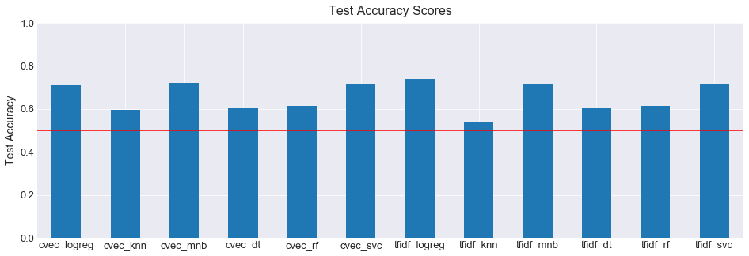
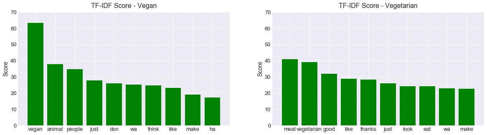

## General Assembly DSI 9 - Gabriel Perez Prieto
## Project 3 - Web APIs & Classification

### Problem Statement:
Classify subreddit posts using NLP (Natural Language Processing)

Why?:
- Accuracy of information on Reddit
- Reliability of source
- Understand behavior of users
- Possibly create a campaign targeting specific groups of people

Subreddits Chosen:
Vegan and Vegetarian

The selection of the Subreddits above was made due to a personal interest on different diets and lifestyles.
From a more broad perspective, I would like to know how difficult would it be to classify vegans and vegetarians,
two very similar categories, based on what is written on Reddit's respective subreddits?

With a good classification model, companies would be able to target specific niches with marketing campaigns for new
products, for example. This would turn those campaigns more effective and possibly cheaper due to better classification
effort with the use of machine learning.

After creating and training models on 75% of the collected data on vegan and vegetarian subreddits, the model was tested
on the remainder 25% of data to check accuracy on predicting in which subreddit each comment was posted in based on the
features selected to run the models on. (Text Body + Engineered Features)

The main performance indicator used to evaluate and tune models was the Accuracy Score on the test data.

### Executive Summary:
#### 01_data_collection - Notebook:
- Libraries Import
- Request Posts from Reddit - PushShift API
- Save Dataset as .csv

#### 02_data_cleaning_eda_preprocessing - Notebook:
- Libraries Import
- Load Dataset
- Feature Engineering
- Data Cleaning
  - Handling Null Values
  - Handling Duplicate Values
- EDA (Exploratory Data Analysis)
  - Correlations of Features with Target Variable
  - Check Means for Features Engineered
  - Visual Representation of Features and Target ( Numerical )
  - Saving Clean Dataset to .csv

#### 03_modeling - Notebook:
- Libraries Import
- Load Clean Dataset
- Create Classes to Lemmatize / Stem Text
- Create X ( features ) and y ( target ) variables
- Establish BaseLine Score
- Create Different Models
  - Pipeline
    - Transformers
      - Column Transformer
      - Count Vectorizer
      - Term Frequency Vectorizer
    - Classifiers
      - Logistic Regression
      - K Nearest Neighbor
      - Naive Bayes
      - Decision Tree
      - Random Forest
      - Support Vector
  - Randomized Search
    - Set Parameters for Each Model
    - Check Models' Performance
- Select and Evaluate Best Model
  - Confusion Matrix
- Check Most Frequent Words

### Conclusion:
Test Accuracy Scores for Models:

Based on the Model's Interpretability and Test Accuracy Score the selected model was:
Logistic Regression + Term Frequency Vectorizer
- Scores:
  - Train Accuracy: 76.3%
  - Test Accuracy: 74.0%
  - Sensitivity: 78.0%
  - Specificity: 69.9%
  - Precision: 72.2%

Most common words for each Subreddit:

The final model had an Accuracy Score on the tested data of 74% which is a big improvement from the baseline
score of 50%. However, categories are similar enough to conclude that it is not an easy task to classify vegans and
vegetarians based on their subreddits on Reddit's website. More data, as well as, data from different sources would
be definitely helpful in order to train a model that would return a better accuracy score.

Engineered features created in the beginning of the project did not seem to have contributed to the model as they
returned essentially the same results regardless of the subreddit. This might work on a different way with other subreddits.

Analyzing the Top 10 most common words for each subreddit we can see, one more time, how similar the categories
are, as 4 of those words are the same out of the 10 most frequent. The same pattern can be observed by looking through
more of the recurrent words.

Besides the actual name of the groups and/or subreddits, vegan and vegetarian, I found very interesting the fact that
the words 'animal' and 'meat' are at the Top 3.

### Next Steps and Model Improvement:
- Incorporate More Data:
  - From other Subreddits
  - From other Sources
  - Identify other groups of people besides Vegan and Vegetarian ( Keto, Paleo etc.)
- Understand Better results for Decision Trees and Random Forests
  - High Specificity / Sensitivity on those Models
- Implement Sentiment Analysis
  - Positive and Negative Comments
- Develop set of StopWords for the Model
